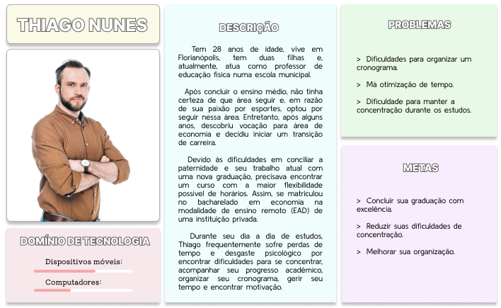

# Especificações do Projeto

Pré-requisitos: <a href="1-Documentação de Contexto.md"> Documentação de Contexto</a>

O propósito do projeto é desenvolver uma Aplicação Web que ajude os alunos a criar uma rotina de estudo de fácil manejo e entendimento. Para atender às necessidades dos usuários, a solução proposta inclui ferramentas que permitem a criação de um cronograma personalizado de estudos, com controle de atividades e prazos de entrega, além de um sistema de "focus time" para ajudar a manter a concentração. 

No desenvolvimento do projeto foram utilizadas técnicas como a definição do diagrama de personas,  análise de concorrência, brainstorming, prototipação, modelagem de dados, histórias de usuários, requisitos funcionais e não funcionais, além das restrições do projeto, que foram montados baseadas no tempo hábil para entrega do projeto.

## Personas

>

## Histórias de Usuários

|EU COMO... `PERSONA`| QUERO/PRECISO ... `FUNCIONALIDADE`  |PARA ... `MOTIVO/VALOR`                 |
|--------------------|------------------------------------ |----------------------------------------|
|Thiago Nunes    | Organizar meu plano de Estudos      | Para organizar meu tempo nos estudos     |
|Amanda Oliveira | Distribuir meu tmpo de estudo entre as disciplinas| Poder acompanhar minha rotina de estudo   |

## Requisitos

As tabelas que se seguem apresentam os requisitos funcionais e não funcionais que detalham o escopo do projeto.

### Requisitos Funcionais

|ID    | Descrição do Requisito  | Prioridade |
|------|-----------------------------------------|----|
|RF-001| O sistema deve permitir o usuário cadastrar, editar e deletar atividades | ALTA | 
|RF-002|O sistema deve permitir a consulta do progresso da atividade | ALTA | 

### Requisitos não Funcionais

|ID     | Descrição do Requisito  |Prioridade |
|-------|-------------------------|----|
|RNF-001| O sistema deve ser responsivo para rodar em um dispositivos móvel | MÉDIA | 
|RNF-002| O sistema deve permitir que o usuário utilize o sistema sem necessidade de treinamento |  ALTA |
|RNF-003| O sistema deve ser possível de migração para outros frameworks |  MÉDIA |

## Restrições

O projeto está restrito pelos itens apresentados na tabela a seguir.

|ID| Restrição                                             |
|--|-------------------------------------------------------|
|01| O projeto deverá ser entregue até o final do semestre |
|02| O projeto deve ser desenvolvido em HTML, CSS E JAVASCRIPT        |
|03| Não pode ser desenvolvido um módulo de backend        |

