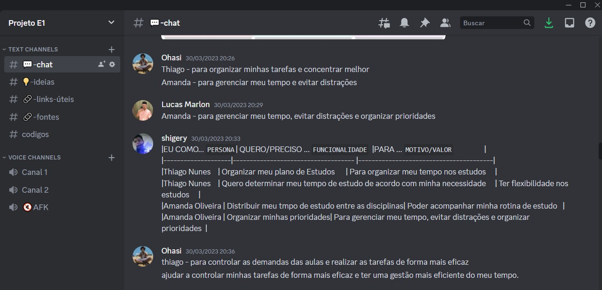
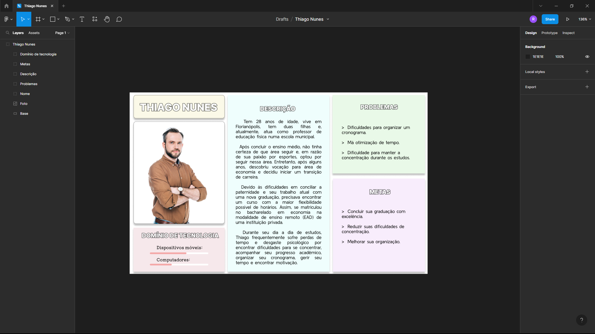
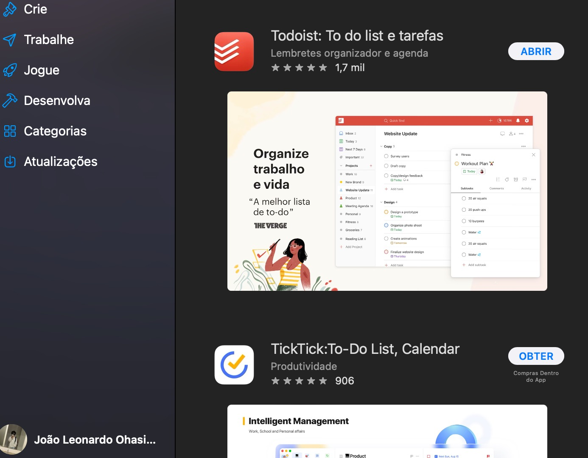
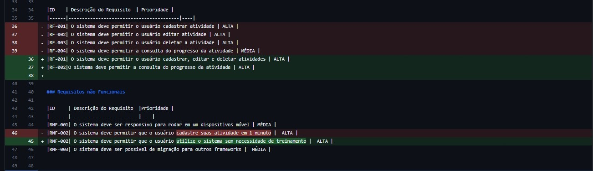
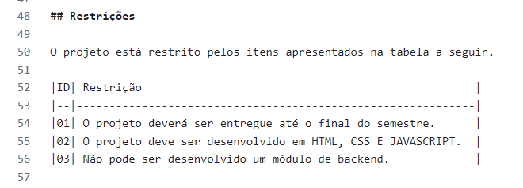
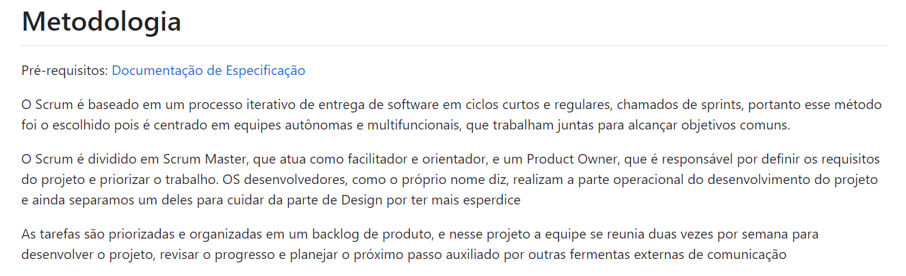
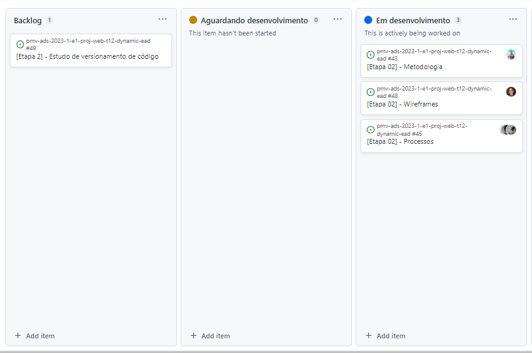
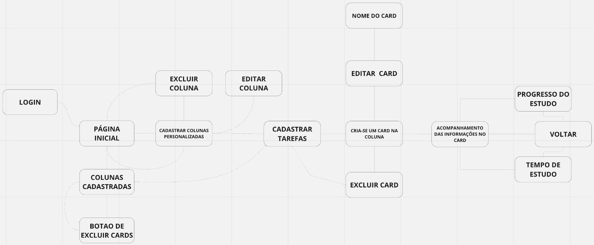
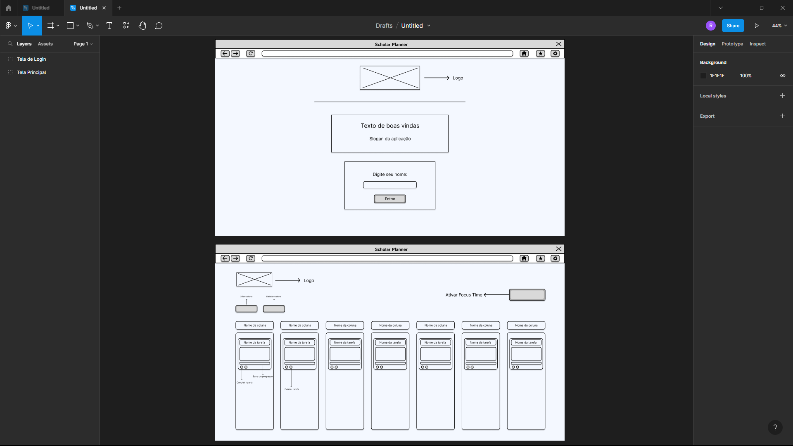

# Metodologia

Pré-requisitos: <a href="2-Especificação do Projeto.md"> Documentação de Especificação</a>

O Scrum é baseado em um processo iterativo de entrega de software em ciclos curtos e regulares, chamados de sprints, portanto esse método foi o escolhido pois é centrado em equipes autônomas e multifuncionais, que trabalham juntas para alcançar objetivos comuns.

O Scrum é dividido em Scrum Master, que atua como facilitador e orientador, e um Product Owner, que é responsável por definir os requisitos do projeto e priorizar o trabalho. OS desenvolvedores, como o próprio nome diz, realizam a parte operacional do desenvolvimento do projeto e ainda separamos um deles para cuidar da parte de Design por ter mais esperdice 

As tarefas são priorizadas e organizadas em um backlog de produto, e nesse projeto a equipe se reunia duas vezes por semana para desenvolver o projeto, revisar o progresso e planejar o próximo passo auxiliado por outras fermentas externas de comunicação

<!-- ## Controle de Versão

A ferramenta de controle de versão adotada no projeto foi o
[Git](https://git-scm.com/), sendo que o [Github](https://github.com)
foi utilizado para hospedagem do repositório.

O projeto segue a seguinte convenção para o nome de branches:

- `main`: versão estável já testada do software
- `unstable`: versão já testada do software, porém instável
- `testing`: versão em testes do software
- `dev`: versão de desenvolvimento do software

Quanto à gerência de issues, o projeto adota a seguinte convenção para
etiquetas:

- `documentation`: melhorias ou acréscimos à documentação
- `bug`: uma funcionalidade encontra-se com problemas
- `enhancement`: uma funcionalidade precisa ser melhorada
- `feature`: uma nova funcionalidade precisa ser introduzida

Discuta como a configuração do projeto foi feita na ferramenta de versionamento escolhida. Exponha como a gerência de tags, merges, commits e branchs é realizada. Discuta como a gerência de issues foi realizada.

> **Links Úteis**:
> - [Tutorial GitHub](https://guides.github.com/activities/hello-world/)
> - [Git e Github](https://www.youtube.com/playlist?list=PLHz_AreHm4dm7ZULPAmadvNhH6vk9oNZA)
>  - [Comparando fluxos de trabalho](https://www.atlassian.com/br/git/tutorials/comparing-workflows)
> - [Understanding the GitHub flow](https://guides.github.com/introduction/flow/)
> - [The gitflow workflow - in less than 5 mins](https://www.youtube.com/watch?v=1SXpE08hvGs) -->

## Gerenciamento de Projeto

### Divisão de Papéis

- **Product Owner**: Alice Coelho de Moura
- **Scrum Master**: Shigery França Dutra Sasaki
- **Equipe de Desenvolvimento**: Mirella Gabriela Silva Bonutty De Freitas, Lucas Marlon Oliveira De Jesus e João Leonardo Ohasi Amorim
- **Equipe de Design**: Renan Stankevicius

### Processo

#### Etapa 1

- 1.1 Planejamento: O projeto foi originado a partir de um debate em um grupo de WhatsApp de alunos que compartilharam suas dificuldades em gerir uma graduação com ensino à distância. A equipe realizou um levantamento de dados e vivências pessoais de alunos para entender melhor os problemas encontrados e concluiu que a criação de uma ferramenta poderia ajudar a melhorar o rendimento dos alunos em suas atividades diárias. A partir dessa ideia, a equipe se reuniu através do Discord para discutir e definir as funcionalidades da aplicação, sempre levando em consideração o ponto de vista do usuário.

- 1.2 Execução: Durante as reuniões do time, foram realizadas pesquisas sobre os pontos positivos e negativos do ensino à distância, além de um debate sobre as experiências dos próprios integrantes. Com base nesses dados, foram identificados os principais desafios encontrados nessa modalidade de ensino. Foram criadas personas fictícias com problemas reais para exemplificar as dificuldades enfrentadas pelos alunos. A seleção do público-alvo foi feita com base em características frequentes de alunos de EAD. Essa etapa foi desenvolvida com base em exemplos obtidos em reuniões com o professor orientador. As histórias de usuário foram executadas de acordo com as necessidades das personas criadas. Houve uma revisão dos requisitos e a equipe definiu as definições imutáveis do projeto, como prazo e linguagem de programação.

- 1.3 Evidências:

> 

> 

> 

> 

> 

#### Etapa 2

2.1 Planejamento: Foram definidas as estratégias, metodologias e ferramentas a serem utilizadas no decorrer do projeto. O professor orientador se reuniu com as equipes de desenvolvimento para definir a metodologia ágil a ser utilizada ao longo do projeto, e posteriormente foram definidas as funções de cada membro da equipe dentro da metodologia aplicada. Foi realizada no Discord uma reunião com todos os integrantes da equipe para definir as ferramentas a serem utilizadas, como VSCode e IntelliJ IDEA para codificação, e Figma e Canva para design. Além disso, foi escolhida a plataforma na qual seria realizado o User flow.

2.2 Execução: A metodologia SCRUM foi escolhida e implementada, com cada membro da equipe tendo uma função específica. Além disso, o método Kanban foi adotado para distribuir as tarefas. O User flow foi construído coletivamente na plataforma Miro levando em consideração os requisitos funcionais e não funcionais, e Renan, responsável pelas definições de design, esquematizou os wireframes da página de login e da página principal no Figma utilizando o User flow como base.

2.3 Evidências: 

> 

> 

> 

> 

#### Etapa 3
•	1.1 Planejamentos: O planejamento da etapa 3 se baseou em requisitos mínimos para a funcionalidade do site. Em base, foram definidas funções para cada um através de nossa reunião semanal no Discord sendo que cada um deveria desenvolver ao menos alguma parte do código em HTML, CSS e Javascript. 

•	1.2 Execução: 
Shigery- Responsável pela criação do HTML CSS da tela de login além da funcionalidade em JavaScript da funcionalidade Drag and Drop dos Cards.
Mirela- Ficou responsável pelo HTML e CSS das colunas principais no qual seriam editáveis.
Lucas- Responsável pela criação dos Cards. Desenvolveu o HTML e o CSS de cada um deles. Na etapa atual foi definido que não desenvolveríamos o JavaScript.
Alice- Ficou responsável pelo JavaScript das funcionalidades que adicionavam e removiam as colunas que o usuário iria utilizar. A Alice também ficou responsável por tornar do botão da tela de Login responsivo para que o nome do cliente apareça na Home-Page.
Leonardo- Responsável pelo desenvolvimento HTML, CSS e JavaScript da funcionalidade FocusTime. 
Renan- Responsável pelo Design de todas as telas do projeto para depois ser desenvolvida pela equipe em HTML e CSS. Também ficou responsável por ajustes em CSS da tela principal.

•	1.3 Evidências:

### Ferramentas

**Ferramentas de desenvolvimento**

- [VSCode](https://code.visualstudio.com/)
- [IntelliJ IDEA ](https://www.jetbrains.com/pt-br/idea/)  
- [Figma](https://www.figma.com)
- [Canva](https://www.canva.com)

O Visual Studio Code e o IntelliJ oferecem uma ampla variedade de recursos para codificação e desenvolvimento, enquanto o Figma e o Canva oferecem recursos de design. Isso garante que a equipe possa trabalhar de forma eficiente, colaborativa e produtiva em todas as etapas do projeto, desde a codificação até o design e a entrega do produto final.

**Ferramentas de comunicação e documentação**

- [Discord](https://discord.com/)
- [WhatsApp](https://whatsapp.com/)
- [Miro](https://miro.com/)
- [Github](https://github.com/)

O whatsapp é uma ferramenta de comunicação rápida e que participa do cotidiano de todos do grupo, mas pecava na comunicação em tempo real, por isso o Discord, por ser uma ferramenta leve, de fácil acesso e com a opção de compartilhamento de tela foi escolhido para ser um suplemento ao whatsapp.
Miro é um aplicativo para criar quadros interativos, reunir e ilustrar ideias, fazer mapas mentais e organizar tarefas. O aplicativo é ideal para organizar ideias em forma de notas adesivas e desenhos.
