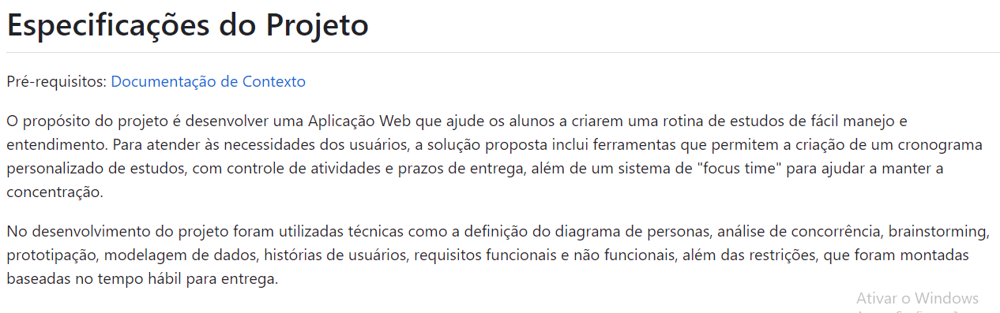
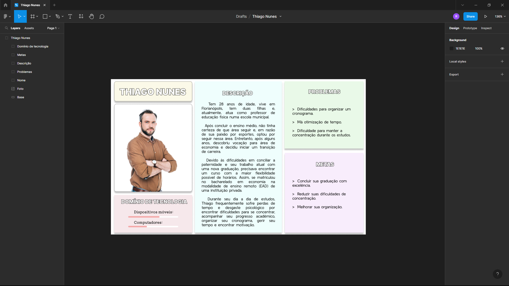
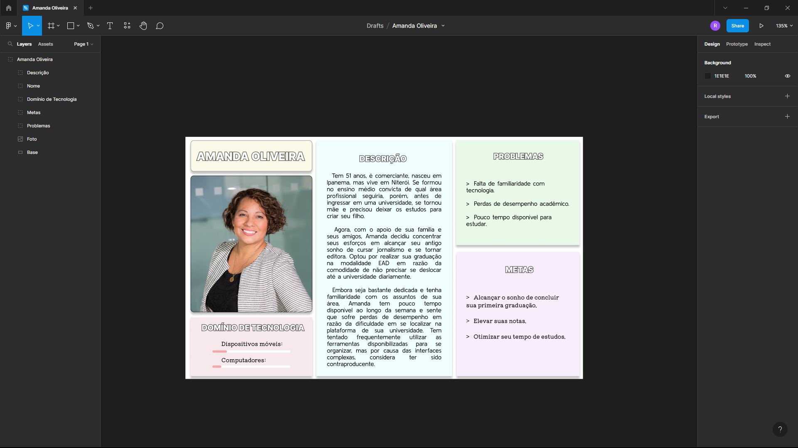
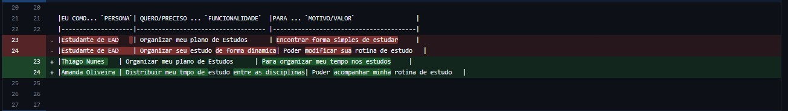
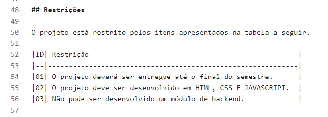
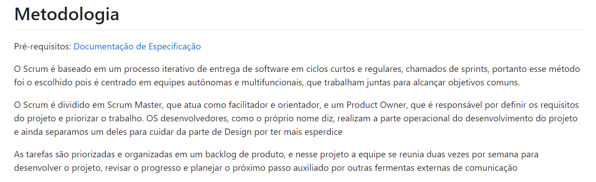
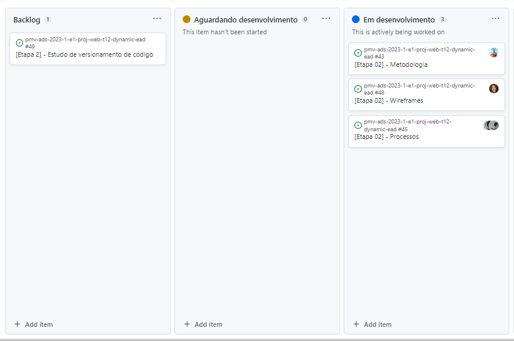

# Metodologia

Pré-requisitos: <a href="2-Especificação do Projeto.md"> Documentação de Especificação</a>

O Scrum é baseado em um processo iterativo de entrega de software em ciclos curtos e regulares, chamados de sprints, portanto esse método foi o escolhido pois é centrado em equipes autônomas e multifuncionais, que trabalham juntas para alcançar objetivos comuns.

O Scrum é dividido em Scrum Master, que atua como facilitador e orientador, e um Product Owner, que é responsável por definir os requisitos do projeto e priorizar o trabalho. OS desenvolvedores, como o próprio nome diz, realizam a parte operacional do desenvolvimento do projeto e ainda separamos um deles para cuidar da parte de Design por ter mais esperdice 

As tarefas são priorizadas e organizadas em um backlog de produto, e nesse projeto a equipe se reunia duas vezes por semana para desenvolver o projeto, revisar o progresso e planejar o próximo passo auxiliado por outras fermentas externas de comunicação

<!-- ## Controle de Versão

A ferramenta de controle de versão adotada no projeto foi o
[Git](https://git-scm.com/), sendo que o [Github](https://github.com)
foi utilizado para hospedagem do repositório.

O projeto segue a seguinte convenção para o nome de branches:

- `main`: versão estável já testada do software
- `unstable`: versão já testada do software, porém instável
- `testing`: versão em testes do software
- `dev`: versão de desenvolvimento do software

Quanto à gerência de issues, o projeto adota a seguinte convenção para
etiquetas:

- `documentation`: melhorias ou acréscimos à documentação
- `bug`: uma funcionalidade encontra-se com problemas
- `enhancement`: uma funcionalidade precisa ser melhorada
- `feature`: uma nova funcionalidade precisa ser introduzida

Discuta como a configuração do projeto foi feita na ferramenta de versionamento escolhida. Exponha como a gerência de tags, merges, commits e branchs é realizada. Discuta como a gerência de issues foi realizada.

> **Links Úteis**:
> - [Tutorial GitHub](https://guides.github.com/activities/hello-world/)
> - [Git e Github](https://www.youtube.com/playlist?list=PLHz_AreHm4dm7ZULPAmadvNhH6vk9oNZA)
>  - [Comparando fluxos de trabalho](https://www.atlassian.com/br/git/tutorials/comparing-workflows)
> - [Understanding the GitHub flow](https://guides.github.com/introduction/flow/)
> - [The gitflow workflow - in less than 5 mins](https://www.youtube.com/watch?v=1SXpE08hvGs) -->

## Gerenciamento de Projeto

### Divisão de Papéis

- **Product Owner**: Alice Coelho de Moura
- **Scrum Master**: Shigery França Dutra Sasaki
- **Equipe de Desenvolvimento**: Mirella Gabriela Silva Bonutty De Freitas, Lucas Marlon Oliveira De Jesus e João Leonardo Ohasi Amorim
- **Equipe de Design**: Renan Stankevicius

### Processo [A FAZER]

#### Etapa 1

#### 1) Introdução

- 1.1 Planejamento: 

- 1.2 Execução: 

- 1.3 Evidências:

#### 2) Problema

- 2.1 Planejamento: 

- 2.2 Execução: 

- 2.3 Evidências:

#### 3) Objetivos

- 3.1 Planejamento: 

- 3.2 Execução: 

- 3.3 Evidências:

#### 4) Justificativa

- 4.1 Planejamento: 

- 4.2 Execução: 

- 4.3 Evidências:

#### 5) Trabalhos Relacionados

- 5.1 Planejamento: A equipe se reuniu através do Discord para discutir quais aplicações se assemelham com a ideia do que está sendo desenvolvido.

- 5.2 Execução: Através de pesquisas na Web, foram filtradas algumas das aplicações mais relevantes para gestão de estudos, onde foi possível identificar recursos disponíveis, facilidade de uso, entre outros aspectos relevantes para fins de comparação.

- 5.3 Evidências:

#### 6) Público-alvo

- 6.1 Planejamento: Foram feitas reuniões via Discord para definir os critérios para a seleção de um público-alvo.

- 6.2 Execução: Os critérios para a seleção de um público-alvo foram definidos com base em características frequentemente identificadas em alunos de ensino à distância que encontram dificuldades na gestão de seus estudos.

- 6.3 Evidências:

#### 7) Especificações do Projeto

- 7.1 Planejamento: A equipe se reuniu no Discord para definir a base que direcionaria cada segmento dessa parte do projeto e quem seria responsável por cada um deles. Ainda, foram obtidas orientações através de reunião com o professor no Microsoft Teams.

- 7.2 Execução: Foram executados Brainstom e longa análise de dados e concorrência para definir as funcionalidades da aplicação. O desenvolvimento do contexto no qual a aplicação seria inserida, bem como a definição das personas que ilustram o público almejado, foram realizados de acordo com exemplos obtidos na reunião com o professor orientador.

- 7.3 Evidências: 

#### 8)Personas

- 8.1 Planejamento: Após discussões da equipe acerca de quais seriam os perfis ideais de usuários, Renan criou suas identidades e o design de suas imagens.

- 8.2 Execução: As fotos das personas foram obtidas através de bancos de imagens online livres de direitos autorais e as imagens foram criadas através da ferramenta de design do software Figma. As histórias e características foram desenvolvidas com base em perfis genéricos que se enquadrariam na proposta da aplicação e seguiram ajustes propostos pelo professor orientador.

- 8.3 Evidências: 

#### 9) Histórias de Usuários

- 9.1 Planejamento: Após a definição e o design das personas, foi realizada uma reunião no Discord para discutir que funcionalidades a aplicação deveria apresentar, de acordo com o ponto de vista do usuário.

- 9.2 Execução: A execução das histórias de usuários foram baseadas nas necessidades das personas. Através de sugestões do professor orientador, foram implementadas algumas mudanças, retirando "usuário: estudante de EAD" e adicionando as personas neste mesmo lugar, além disso, houveram alterações em "funcionalidades" e "motivo/valor".

- 9.3 Evidências:

#### 10) Requisitos

- 10.1 Planejamento: Alice demonstrou interesse em realizar os requisitos funcionais e não funcionais por ter experiência em realizar os mesmos, assim, ela ficou encarregada de elaborar esta parte.

- 10.2 Execução: A execução dos requisitos foi realizada por Alice. Após orientação do professor orientador, foi realizada substituição de alguns requisitos. Com a revisão e aprovação de todos os membros do time, Shigery adicionou as mudanças ao Github.

- 10.3 Evidências:

#### 11) Restrições

- 11.1 Planejamento: As restrições foram planejadas de acordo com a necessidade do projeto e em colaboração com grupo de desenvolvimnento.

- 11.2 Execução: A equipe definiu quais seriam as definições imutáveis do desenvolvimento do projeto, como prazo, grau de complexidade do sistema e linguagem de programação utilizada.

- 11.3 Evidências:

#### Etapa 2

#### 1) Metodologia

- 1.1 Planejamento: O professor orientador realizou uma reunião com as equipes de desenvolvimento para definir a metodologia que seria empregada ao longo do projeto.

- 1.2 Execução: Foi apresentada e escolhida a metodologia SCRUM. Definiu-se então a função de cada membro da equipe dentro dessa metodologia. Além disso, foi apresentado e definido o método Kanban como forma de distribuição de afazeres.

- 1.3 Evidências:

#### 2) Divisão de Papéis

- 2.1 Planejamento: Através de reuniões da equipe, foram discutidas quais seriam as funções ideais de cada membro dentro da metodologia aplicada.

- 2.2 Execução: A divisão de papéis no modelo SCRUM foi definida de modo que cada membro da equipe tivesse uma função específica e bem definida, para trabalhar em colaboração e garantir a eficiência e qualidade do produto final.

- 2.3 Evidências:

#### 3) Processo

- 3.1 Planejamento: 

- 3.2 Execução: 

- 3.3 Evidências:

#### 4) Ferramentas

- 4.1 Planejamento: 

- 4.2 Execução: 

- 4.3 Evidências:

#### 5) Userflow

- 5.1 Planejamento: Foi realizada reunião no Discord para definir a plataforma a ser utilizada para a elaboração do userflow. Definiu-se que seria desenvolvido com a presença de todos os integrantes da equipe.

- 5.2 Execução: O userflow foi elaborado utilizando a plataforma Miro, aplicando o que se encaixaria para atender aos requisitos funcionais e não funcionais.

- 5.3 Evidências:

#### 6) Wireframes

- 6.1 Planejamento: Sendo responsável pelas definições de design, Renan utilizou o Userflow como base para a elaboração dos wireframes da aplicação.

- 6.2 Execução: Utilizando o software Figma, foram esquematizados os wireframes da página de login e da página principal da aplicação.

- 6.3 Evidências:

#### A) Introdução
 
> **Links Úteis**:
> - [Project management, made simple](https://github.com/features/project-management/)
> - [Sobre quadros de projeto](https://docs.github.com/pt/github/managing-your-work-on-github/about-project-boards)
> - [Como criar Backlogs no Github](https://www.youtube.com/watch?v=RXEy6CFu9Hk)
> - [Tutorial Slack](https://slack.com/intl/en-br/)

### Ferramentas

**Ferramentas de desenvolvimento**

- [VSCode](https://code.visualstudio.com/)
- [IntelliJ IDEA ](https://www.jetbrains.com/pt-br/idea/)  
- [Figma](https://www.figma.com)
- [Canva](https://www.canva.com)

O Visual Studio Code e o IntelliJ oferecem uma ampla variedade de recursos para codificação e desenvolvimento, enquanto o Figma e o Canva oferecem recursos de design. Isso garante que a equipe possa trabalhar de forma eficiente, colaborativa e produtiva em todas as etapas do projeto, desde a codificação até o design e a entrega do produto final.

**Ferramentas de comunicação e documentação**

- [Discord](https://discord.com/)
- [WhatsApp](https://whatsapp.com/)
- [Miro](https://miro.com/)
- [Github](https://github.com/)

O whatsapp é uma ferramenta de comunicação rápida e que participa do cotidiano de todos do grupo, mas pecava na comunicação em tempo real, por isso o Discord, por ser uma ferramenta leve, de fácil acesso e com a opção de compartilhamento de tela foi escolhido para ser um suplemento ao whatsapp.
Miro é um aplicativo para criar quadros interativos, reunir e ilustrar ideias, fazer mapas mentais e organizar tarefas. O aplicativo é ideal para organizar ideias em forma de notas adesivas e desenhos.
