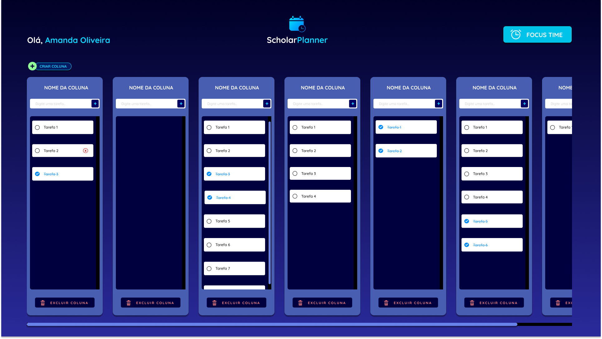

# Template padrão do site

## Tela Inicial

Durante o processo de tela inicial foi discutido 2 aspectos base sendo eles: Layout da Tela e como seria o Formato do Login. Inicialmente se pensarmos numa tela de login a primeira coisa que nos vem à cabeça seria um Usuário e Senha, mas como uma de nossas restrições é não trabalhar com um BackEnd não seria logico ter uma tela de Login dessa forma. Mas se não haveria isso, como personalizaríamos a página e salvamos o usuário? 

A resposta foi colocar um nome que no qual o usuário se identificasse que apareceria na tela seguinte. Além disso o Layout teria que ser minimalista, mas ao mesmo tempo moderno e que representasse profissionalismo. Escolhemos a cor azul pois em geral, o azul escuro é associado à estabilidade, seriedade, segurança, poder, confiança, inteligência e profissionalismo. 

## Layout Beta
A respeito do programa em si em seu desenvolvimento foi pensado em um painel simples, isso se deve pela pesquisa de público-alvo que realizamos na etapa de Documentação de Contexto e no aprofundamento através das personas Thiago Nunes e Amanda Oliveira. As cores temas baseadas no azul escuro foram mantidas na plataforma.   

Pensando neles, foi centralizada a maioria das funções em um painel principal, a nossa Home Page na qual foi trabalhada de forma que possa ser feito a adição e remoção de colunas editáveis de acordo com o que o usuário desejar, como pilares de estudo. 

Dentro da região das colunas é permitido adicionar Cards nos quais as atividades podem ser cadastradas. Os Cards por sua vez são editáveis contando com formas de se colocar links, textos, imagens, anotações e vídeos. 

Para deixar o estilo de criação mais livre a modalidade Drag and Drop que seria traduzida como Arrastar e Soltar foram adotados, permitindo mais liberdade e flexibilidade na criação do plano de estudos.

)

Pré-requisitos: <a href="2-Especificação do Projeto.md"> Especificação do Projeto</a>, <a href="3-Projeto de Interface.md"> Projeto de Interface</a>, <a href="4-Metodologia.md"> Metodologia</a>

Layout padrão do site (HTML e CSS) que será utilizado em todas as páginas com a definição de identidade visual, aspectos de responsividade e iconografia.

> **Links Úteis**:
>
> - [CSS Website Layout (W3Schools)](https://www.w3schools.com/css/css_website_layout.asp)
> - [Website Page Layouts](http://www.cellbiol.com/bioinformatics_web_development/chapter-3-your-first-web-page-learning-html-and-css/website-page-layouts/)
> - [Perfect Liquid Layout](https://matthewjamestaylor.com/perfect-liquid-layouts)
> - [How and Why Icons Improve Your Web Design](https://usabilla.com/blog/how-and-why-icons-improve-you-web-design/)
