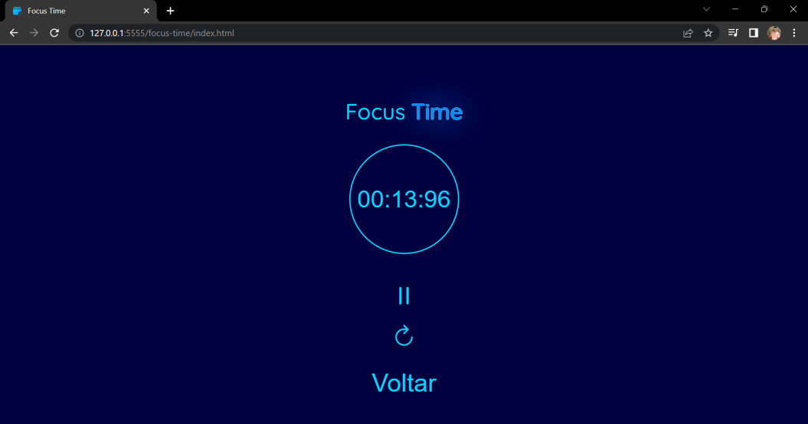

# Programação de Funcionalidades

# Funcionalidades do sistema

Nesta seção são apresentadas as telas desenvolvidas para cada uma das funcionalidades do sistema. O respectivo endereço (URL) e outras orientações de acesso são são apresentadas na sequência.

### Landing page

#### TELA DE LOGIN
A tela principal apresenta um menu simples para entrada através do nome ou apelido que a pessoa escolher. Após o click somos direcionas para a tela de Home na qual será exibido o nome da pessoa junto com o a tela de planejamento. Se você nao colocar nada dentro do campo "Digite seu nome" aparecerá uma mensagem informando que você precisa de digitar algo para porsseguir.

__Requisitos atendidos__
* RF-001 - O sistema deve permitir acesso por uma tela de login.;

__Artefatos da funcionalidade__
* index.html;
* style.css;
* script.js

__Instruções de acesso__

1. Abra um navegador de internet e informe a seguinte URL: https://icei-puc-minas-pmv-ads.github.io/pmv-ads-2023-1-e1-proj-web-t12-dynamic-ead/src/
2. Digite seu Apelido e clique em Entrar.

#### HOME-PAGE
A Home-Page tem várias funcionalidades sendo elas as Colunas, os Cards e o FocusTime. A intenção é  ter uma tela interativa e de fácil compreensão do usuário podendo arrastar e soltar, criar e deletar Colunas e Cards.

__Requisitos atendidos__
* RF-002 O sistema deve permitir a criação, edição e remoção de colunas de atividades.
* RF-004 O sistema deve ter um metodo de gestão de tempo.   

__Artefatos da funcionalidade__

* src/home/home.html;
* src/home/home.css;
* src/home/home.js

__Instruções de acesso__

1. Faça o login.
2. Clique no botao "CRIAR COLUNA" uma coluna será adicionada.
3. Clique no botão "EXCLIR COLUNA" e a coluna será excluida.
4. Clique no botão "FOCUSTIME" e sera direcionado para a o cronometro.

#### HOME-PAGE
FocusTime é uma ferramenta de gestão do tempo, como base tem um cronometro que marcara o tempo de estudo.

__Requisitos atendidos__
* RF-004 O sistema deve ter um metodo de gestão de tempo.   

__Artefatos da funcionalidade__

* src/focus-time/index.html
* src/focus-time/script.js
* src/focus-time/style.css

__Instruções de acesso__

1. Clique no botao "START" o cronometro se inicia.
2. Clique no botão "STOP" o cronometro para.
3. Clique no botão "RESET" o cronometro zera.
4. Clique no botão "VOLTAR" e voltara para página HOME-PAGE.

