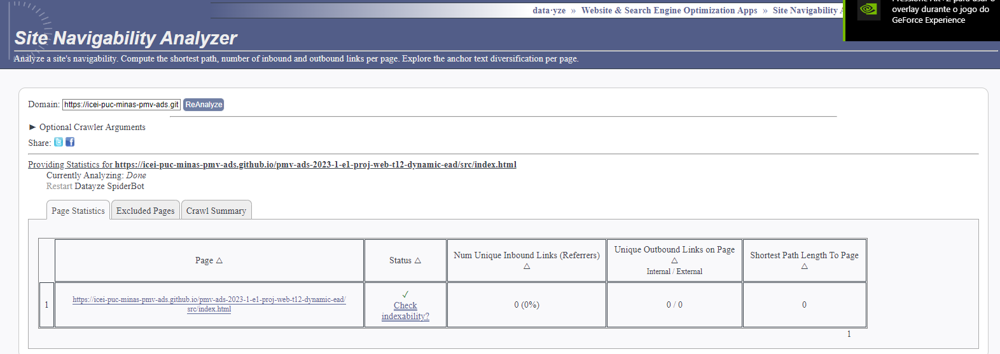
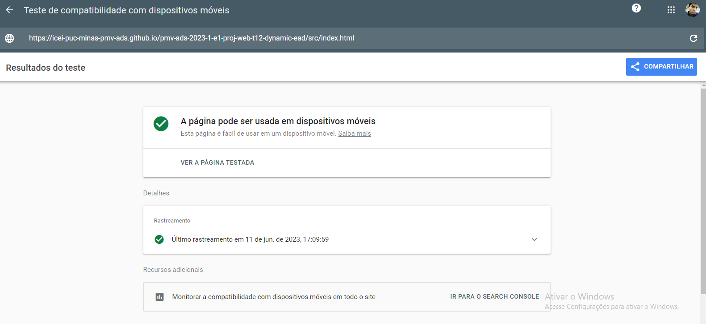
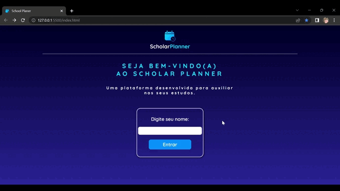
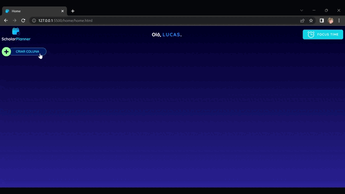
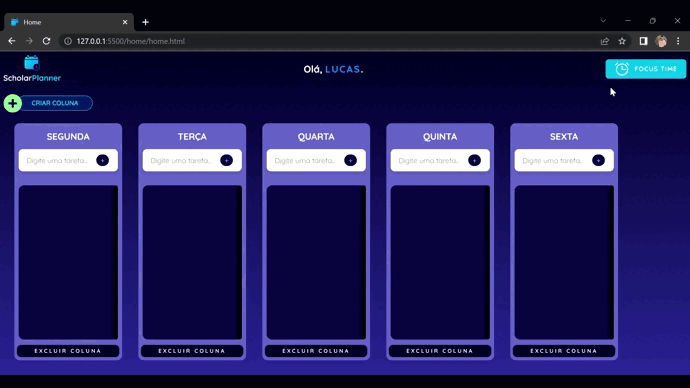
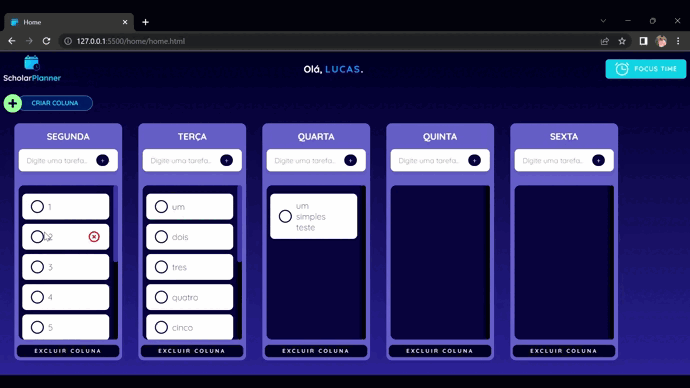
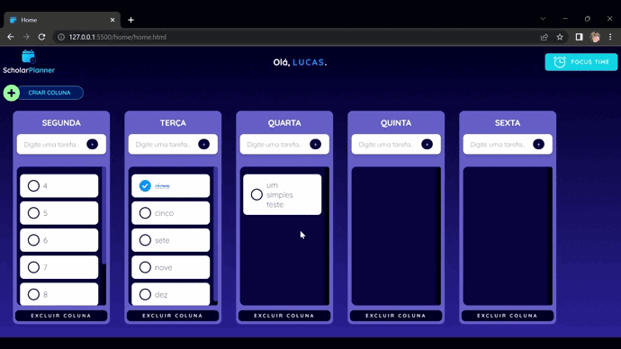

# Plano de Testes de Software

## Testes de Navegabilidade

Tem por objetivo verificar se todos os links são navegáveis, estão corretos e levam o usuário a uma outra tela existente na aplicação.
Os Testes automatizados foram realizados através de: https://datayze.com/site-navigability-analyzer

## Teste de Responsabilidade

Os testes de responsividade foram automatizados por Google. Teste de compatibilidade com dispositivos móveis atravez do link: https://search.google.com/test/mobile-friendly?hl=pt

## Teste de Login  -RESPONSAVEL: Mirela

Foram realizados três testes conforme GIF:

- **1ª Tste**: Teste de Login sem nome;
- **2ª Tste**: Teste de Login direto e direcinamento para Home-Page;
- **3ª Tste**: Nick-Save (salvar o nome do usuario).
 

## Teste de Criação de Colunas -RESPONSAVEL: Renan

Foram realizados três testes conforme GIF:

- **1ª Tste**: Teste de Modal;
- **2ª Tste**: Teste de Criação de Colunas sem nome;
- **3ª Tste**: Teste de Criação de colunas com nome.

 

## Teste de Criar Tarefas -RESPONSAVEL: Shigery

Foram realizados dois testes conforme GIF:

- **1ª Tste**: Teste de Criação de Tarefas;
- **2ª Tste**: Teste de Limitação de area com rolagem;

## Teste Focus Time (Cronometro) -RESPONSAVEL: Lucas

Foram realizados dois testes conforme GIF:

- **1ª Tste**: Teste de transição para a página Focus Time;
- **2ª Tste**: Teste de Play, Pause e Reset;

## Teste de Conclusão de Tarefas -RESPONSAVEL: Leonardo

Foram realizados dois testes conforme GIF:

- **1ª Tste**: Teste de Tarefa Concluida;
- **2ª Tste**: Teste de Excluir Tarefa;

## Teste de Exclusão de Colunas -RESPONSAVEL: Alice

Foi realizado um teste conforme GIF:

- **1ª Tste**: Teste de Exclusão de tarefa;

